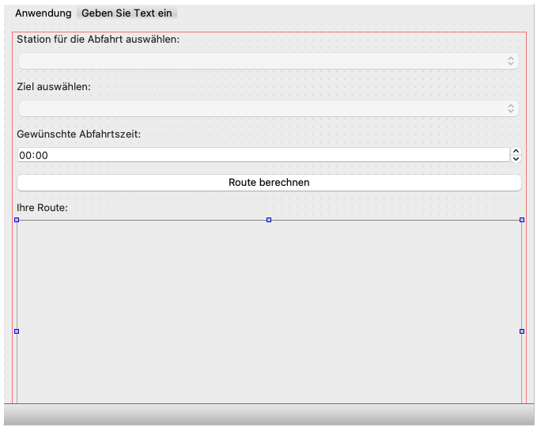

# Übungsblatt 5
In dieser Übung verbinden Sie Ihre Ergebnisse aus den vorherigen Übungen 3. und 4. und integrieren die Berechnung von Fahrtstrecken in Ihre Qt-Oberfläche. Die Inhalte, mit denen die Anwendung arbeiten soll, befinden sich im Ordner `GTFSShort` des Repositories zu dieser Übung. Außerdem finden Sie den Ordner `GTFSBbg` im Repository, welcher Informationen über die Linien der Verkehrsbetriebe Potsdam und DB Regio AG enthält.

## a) Auswertung der zone_id
In der letzten Übung haben Sie für jeden Stop den `locationType` ausgewertet und um Bahnhofs-Stationen und zugehörigen Gleise zu ermitteln. Es gibt im GTFS-Standard jedoch noch eine weitere Möglichkeit um Haltestellen für Umstiegsmöglichkeiten zu gruppieren: die `zoneId`.

Diese Gruppierung wird bspw. dann angewendet, wenn es sich bei den Haltestellen um Bahngleise und Bushaltestellen handelt. Schauen Sie sich dazu im Ordner `GTFSBbg` alle Einträge für die `zoneId = "5750 S Potsdam Hauptbahnhof"` an:

|`stop_id`|`stop_desc`|`location_type`|`parent_station`|`zone_id`|
|---|---|---|---|---|
| de:12054:900230999:1:50 | Bahnsteig Gleis 1 | 0 | de:12054:900230999 | 5750 S Potsdam Hauptbahnhof |
| de:12054:900230999:2:52 | Bahnsteig Gleis 2 | 0 | de:12054:900230999 | 5750 S Potsdam Hauptbahnhof |
| de:12054:900230999:1:51 | Bahnsteig Gleis 3 | 0 | de:12054:900230999 | 5750 S Potsdam Hauptbahnhof |
| de:12054:900230999:2:53 | Bahnsteig Gleis 4 | 0 | de:12054:900230999 | 5750 S Potsdam Hauptbahnhof |
| de:12054:900230999 |  | 1 | *leer* | 5750 S Potsdam Hauptbahnhof |
| de:12054:900230999::1 | Tramsteig 1 | 0 | *leer* | 5750 S Potsdam Hauptbahnhof |
| de:12054:900230999::2 | Tramsteig 2 | 0 | *leer* | 5750 S Potsdam Hauptbahnhof |
| de:12054:900230999::3 | Bussteig 3 | 0 | *leer* | 5750 S Potsdam Hauptbahnhof |
| de:12054:900230999::4 | Bussteig 4 | 0 | *leer* | 5750 S Potsdam Hauptbahnhof |
| de:12054:900230999::5 | Bussteig 5 | 0 | *leer* | 5750 S Potsdam Hauptbahnhof |
| de:12054:900230999::6 | Bussteig 6 | 0 | *leer* | 5750 S Potsdam Hauptbahnhof |
| de:12054:900230999::7 | Bussteig 7 | 0 | *leer* | 5750 S Potsdam Hauptbahnhof |

Sie sehen, dass die Bahngleise zwar über die `parentStation` zum Bahnhof zugeordnet werden, die Tram- und Bushaltestellen jedoch keine Daten im Feld `parentStation` besitzen, obwohl man an dem Bahnhof vom Zug in die Tram/ den Bus umsteigen kann. Diese Zusammengehörigkeit wird in der `zoneId` gespeichert, denn hierüber können Sie erkennen, dass diese Stationen zusammengehören und ein Umstieg möglich ist.

1. Erweitern Sie die Methode `getStopsForTransfer` in Ihrer Network-Klasse so, dass auch Haltestellen, welche über die gleiche `zoneId` verfügen zurückgegeben werden.

## b) Routen berechnen mit zeitlichen Vorgaben
Der Navigations-Algorithmus zur Berechnung einer Route von einer Start-Haltestelle zu einer Ziel-Haltestelle soll nun erweitert werden um einen zusätzlichen Parameter: **die Abfahrtszeit**. 

Dazu verwenden Sie weiterhin die Informationen über Linien (`routes`), Fahrten (`trips`), Haltestellen (`stops`) und Haltestellen der Fahrten (`stop_times`). Die Abfahrts- und Ankunftszeiten befinden sich in den Datenstrukturen aus der Datei `stop_times` in den Feldern `arrivalTime` und `departureTime`.

1. Erzeugen Sie eine neue Methode `getTravelPlanDepartingAt` in der Klasse `Network` welche die Start- und End-Haltestelle sowie die gewünschte Abfahrtszeit entgegen nimmt:

```cpp
std::vector<bht::StopTime> getTravelPlanDepartingAt(const std::string& fromStopId, const std::string& toStopId, const GTFSTime& departureTime);
```

2. Der Rückgabetyp ist ein Vektor mit `StopTime`-Datenstrukturen, welche die jeweiligen Halte auf der berechneten Route zu den ausgewiesenen Zeiten beinhaltet. Der zurückgegebenen Vektor von soll alle Haltestellen in der Reihenfolge in der sie angefahren werden enthalten. 

3. Überarbeiten Sie Ihren Dijkstra-Algorithmus so, dass nun nur noch Routen ermittelt werden, welche zu der angegebenen Abfahrtszeit passen. Die Ankunftszeit an einer Haltestelle an Position i in dem Ergebnis-Vektor soll dabei immer größer/gleich sein der Abfahrtszeit an der Haltestelle an Position i-1. Wenn zu einem anderen Gleis / Haltestelle umgestiegen werden soll nehmen wir **keine Umstiegszeit** an.

4. Verbessern Sie Ihren Algorithmus so, dass ein leerer Vektor zurückgegeben wird, wenn keine Route zwischen den beiden angegebenen Haltestellen zu der gewünschten Fahrzeit existiert.

## c) Erweiterung der GUI
Erweitern Sie Ihre grafische Oberfläche so, dass nun eine Station als Start und Ziel ausgewählt werden kann (bspw. mit einer `QComboBox`). Außerdem soll eine Abfahrtszeit eingegeben werden können (bspw. mit einem `QTimeEdit`).



Wenn alle Informationen ausgewählt worden sind soll der Anwender/ die Anwenderin mit einem Button die Berechnung der Route starten können.  Wenn das Ergebnis vorliegt werden die Stationen der Route in der Tabelle im unteren Bereich des Fensters angezeigt. Verwenden Sie dafür gerne Ihre Tabelle aus Übung 3.

1. Passen Sie Ihre grafische Oberfläche gemäß der Vorgaben an (Aussehen, Anordnung, Farbgebung etc. sind Ihnen überlassen).

2. Denken Sie an gute Usability. Schalten Sie bspw. Auswahl- und Eingabefelder erst frei, wenn die vorherigen Auswahlen gemacht wurden.

3. Implementieren Sie die Ermittlung der Route gemäß der Einstellungen beim Klick auf den entsprechenden Button und zeigen Sie das Ergebnis in Ihrer Tabelle an.

4. (Optional) Fügen Sie bspw. ein weiteres Feld hinzu um eine minimale Umstiegszeit oder auch eine Ankunftszeit eingeben zu können. _Hinweis: Implementieren Sie die dafür notwendigen Algorithmen in neuen Methoden, sodass die vorgegebene Signatur und Funktionsweise von `getTravelPlanDepartingAt` unverändert bleibt für die automatische Prüfung._

## d) Abgabe und automatische Auswertung
Die automatische Auswertung prüft die Methoden aus den Aufgaben a) und b). Sie finden im Repository der Übungsaufgabe erneut die Datei `tester.cpp`. Diese Datei enthält wieder die Testfälle für Ihre Anwendung. Diese können Sie sich ansehen und selbst prüfen ob Ihre Anwendung diese Testfälle erfüllt. Die Tests werden mit dem Googletest-Framework realisiert (https://github.com/google/googletest).

Die Datei `tester.cpp` darf von Ihnen nicht verändert werden. Die Integrität der Datei wird bei der automatischen Auswertung per Prüfsumme verifiziert.

Die folgenden Anforderungen werden in der Abgabe geprüft:
1. Die Datei `tester.cpp` ist unverändert.
2. Die Anwendungen kann übersetzt werden mit `qmake`.
3. Ihre Abgabe enthält wieder ein `Makefile` mit dem Target `autotest`, welche Die Datei `tester.cpp` mit den benötigten Quellcode-Dateien übersetzt und die Datei `test_runner` erzeugt. Der Befehl zum Übersetzen Ihrer Anwendung sollte wieder beginnen mit dem unten genannten Kommando gefolgt von Ihren C++-Quelldateien (außer denen mit der main-Methode und dem Qt-Fenster)

```bash
g++ -I. -I/usr/local/include -std=c++17 -o test_runner /usr/local/lib/libgtest_main.a /usr/local/lib/libgtest.a <Ihre CPP-Dateien...>
```
4. Die Unit-Tests für die Aufgaben a) und b) können ohne Fehler ausgeführt werden.
5. Eine Plagiatsprüfung findet keine Treffer.